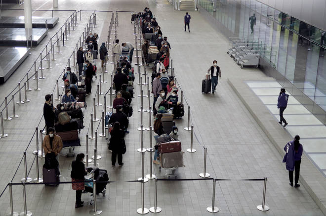

+++
author = "TrucJ"
title = "Large-scale System Design"
date = "2022-05-16"
description = "Design pattern in Golang."
tags = [
    "Golang",
    "design pattern",
]
categories = [
    "Golang",
    "design pattern",
]
image = "banner.png"
+++

Since I am a newbie and do not have too much expertise, I will share in the easiest way to understand this topic.

Instead of talking about how to build a particular system, I am going to give a general introduction to how to build a large scale system.

# General methods
Handling a large number of requests in one system is like serving multiple customers in a store or an airport. If you have a store and a constant flow of customers, you need to find a way to please everyone. There are two simple general methods to do that.

## Method 1. Increase queue size
**The first method is to increase the size of the queue.**

> _Airports or public restaurants often design long queues to accommodate many customers. When customers are queued up, they get the feeling that they will soon be served and will be satisfied with the store._

Similar to our system, when queued, users will be notified to let them know that their request is about to be processed. This will make the user happy.

### Advantage
The advantage of this method is that it does not cost too much to implement and maintain the system.
### Disadvantage

The disadvantage of this method appears when there are too many requests in a queue, then the waiting time to be processed will take a long time and will bring a bad experience to the user.

## Method 2. Increase the number of processing threads
We see that the above method is not good performance when the number of users exceeds the allowed threshold. Therefore, **increasing the number of processing threads is the method used in combination**.

If method 1 only gives the user the feeling that the request is being processed, then this method will help the user get processed really quickly.

When many threads work at the same time, the processing time of the whole system will be much faster, which is called parallel processing. More specifically, if the number of threads is doubled, the user's waiting time will be halved.

> _Just like serving customers in stores, if the number of waiters/waitresses increases, customers will feel more satisfied because they are served faster._

### Advantage
The advantage of this method is that it greatly improves performance.

### Disadvantage
The disadvantage of this method is that it is expensive to implement and maintain the system.

# Specific methods
In addition to the general methods, there are a number of methods that can be applied in specific cases.

## Flexible number of threads
These is a question that: _If we apply the above two methods and still have a full queue, how will we handle it?_

We cannot use method 1 because there cannot be a queue that is too long. We cannot use method 2 because when the number of requests decreases, the number of requests will be redundant and cost the operation.

So that, the better method is using flexible threads. This means that when the number of requests is large enough and close to the threshold, we will allocate more threads to help the system process faster to match that time. When the rush hour is over, the number of requests decreases, we can recall the flexible threads to reserve for other processes.

> We can easily see this method in real life. Coffee shops are usually more staffed during busy times and less staffed the rest of the time.

### Advantage
Optimize costs and still serve a large number of requests at peak times.
### Disadvantage
Must be set up so that the machines can be flexible when needed.

## Divide and conquer
When building a large system, we can divide the system into a number of subsystems that specialize in certain tasks. When a subsystem is specialized, we can use techniques to make that subsystem run better and faster.

Moreover, when we divide the large system into subsystems, we will work better in the latter case. If there are requests that can be handled without including the jobs of all subsystems, those requests will not have to wait too long to be processed and responded to.

> _A real-life example is when you go to cinemas like CGV, you will find that there are separate ticket stalls and popcorn stalls. Then, customers who only want to buy popcorn will not have to wait for the system to serve those who buy tickets in advance._

### Advantages
- Process specialization.
- Processing speed is faster than method 2.

### Disadvantages
Although there are many advantages, this method should only be applied to large projects for the following reasons:
- Subprocesses need cost to implement. Because to specialize, we need to rebuild so that subprocess works best.
  When a request includes multiple subprocesses, we need to manage the order in which the subprocesses are called.
- Difficult to trace the processing of a request.
- It is not always possible to split into subprocesses. Usually only large projects can be divided into specialized subprocesses.

# Conclude

Designing a large-scale system is a common problem for many companies. There are many methods to perform, but no method is the best, is perfect. Depending on the case, we will have specific methods for that context.

_Thank you everyone for reading my first blog, goodbye and see you on the next blog._