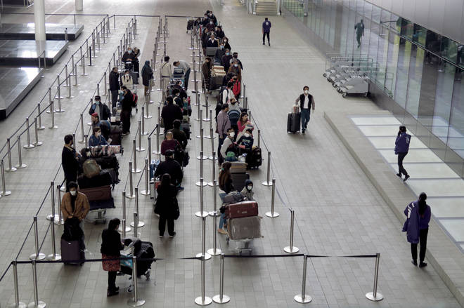
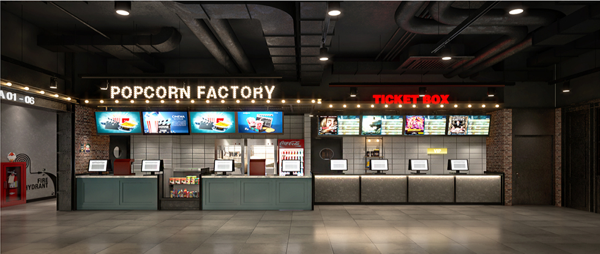

+++
author = "TrucJ"
title = "Large-scale System Design"
date = "2022-05-16"
description = "An overview of how to design a system that serves a large user base for beginners."
tags = [
    "system design",
    "large-scale system",
    "beginner",
]
categories = [
    "System",
]
image = "pawel-czerwinski-8uZPynIu-rQ-unsplash.jpg"
+++

Instead of talking about how to build a particular system, I am going to give a general introduction to how to build a large scale system.

# General methods
Handling a large number of requests in one system is like serving multiple customers in a store or an airport. If you have a store and a constant flow of customers, you need to find a way to please everyone. There are two simple general methods to do that.

## Method 1. Increase queue size
The first method is to increase the size of the queue.

Airports or public restaurants often design long queues to accommodate many customers. When customers are queued up, they get the feeling that they will soon be served and will be satisfied with the store.\
Similar to our system, when queued, users will be notified to let them know that their request is about to be processed. This will make the user happy.
### Advantages
The advantage of this method is that it does not cost too much to implement and maintain the system.
### Disadvantages
The disadvantage of this method appears when there are too many requests in a queue, then the waiting time to be processed will take a long time and will bring a bad experience to the user.

## Method 2. Increase the number of processing threads
We see that the above method is not good performance when the number of users exceeds the allowed threshold. Therefore, increasing the number of processing threads is the method used in combination.\
If method 1 only gives the user the feeling that the request is being processed, then this method will help the user get processed really quickly.\
When many threads work at the same time, the processing time of the whole system will be much faster, which is called parallel processing. More specifically, if the number of threads is doubled, the user's waiting time will be halved.\
Just like serving customers in stores, if the number of waiters/waitresses increases, customers will feel more satisfied because they are served faster.\
### Advantages
The advantage of this method is that it greatly improves performance.
### Disadvantages
The disadvantage of this method is that it is expensive to implement and maintain the system.

# Specific methods
In addition to the general methods, there are a number of methods that can be applied in specific cases.

## Handle each subprocess
When building a large system, we can divide the system into a number of subsystems that specialize in certain tasks. When a subsystem is specialized, we can use techniques to make that subsystem run better and faster.\
Moreover, when we divide the large system into subsystems, we will work better in the latter case. If there are requests that can be handled without including the jobs of all subsystems, those requests will not have to wait too long to be processed and responded to.\
A real-life example is when you go to cinemas like CGV, you will find that there are separate ticket handle and popcorn stalls. Then, customers who only want to buy popcorn will not have to wait for the system to serve those who buy tickets in advance.

